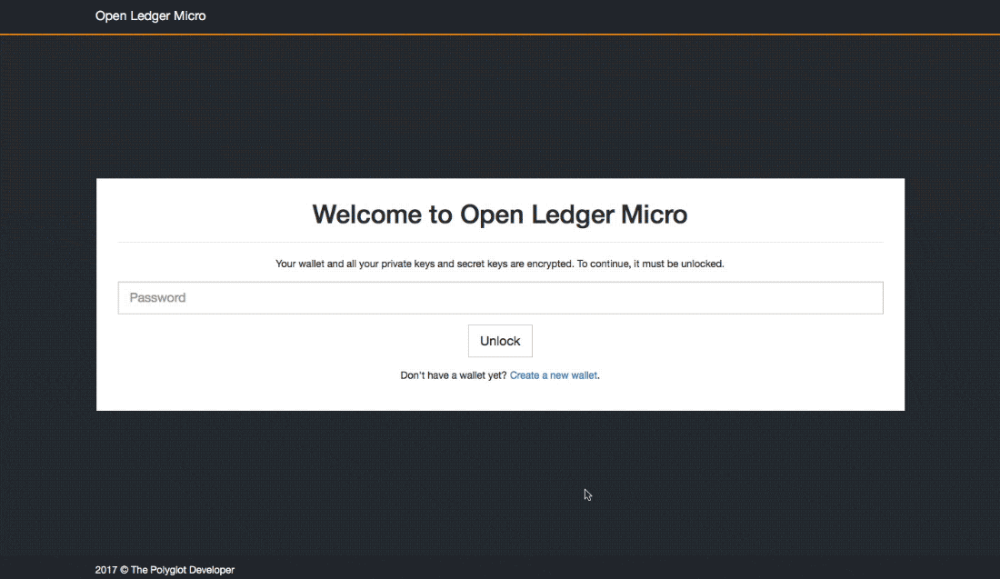

# Open Ledger Micro

An open source hardware wallet application for Raspberry Pi Zero devices, written in Golang and Angular.

## How it Works

The Raspberry Pi Zero is a $5.00 computer with no WiFi or Bluetooth and can be configured to emulate Ethernet over USB. The application written in Go and Angular, serves a RESTful API to be consumed with the integrated Angular application.

Once configured, software like Bonjour on a host machine will allow the Raspberry Pi Zero to be accessed by its hostname. For example, http://raspberrypi.local would show the Angular web application.

Sensitive information such as private keys are encrypted on the Raspberry Pi and are never exposed through HTTP. Transactions are created and signed directly on the device and returned to the Angular application.

## Disclaimer

I, Nic Raboy, am not a cryptocurrency or cryptography expert. Take time to understand how Bitcoin and other cryptocurrencies work and use this project at your own risk. If you lose your keys or send your coins into a black hole, nobody is responsible except yourself.

## Contact Me

If you'd like to contact me about the project, find me on Twitter at [@nraboy](https://www.twitter.com/nraboy).

## Resources

[Create a Bitcoin Hardware Wallet with Golang and a Raspberry Pi Zero](https://www.thepolyglotdeveloper.com/2018/03/create-bitcoin-hardware-wallet-golang-raspberry-pi-zero)
